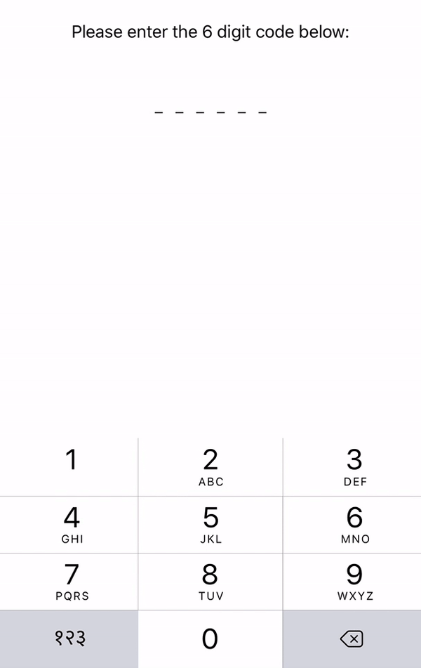

SACodedTextField
===============

A simple text field for building 'activation code text field' like [WhatsApp](https://www.whatsapp.com/) for iOS

Preview
---

### Emoji

### Default

CocoaPods
---
You can install `SACodedTextField` through CocoaPods adding the following to your Podfile:

pod 'SACodedTextField'

Usage
---
Check out the [demo app](https://github.com/SandeepAggarwal/SACodedTextField/archive/master.zip) for an example.

`SACodedTextField` can be added to storyboard or instantiated programmatically:
~~~objective-c
ActivationCodeTextField* textField = [[ActivationCodeTextField alloc] initWithFrame:frame];
[self.view addSubview:textField];
~~~

A `SACodedTextField` can be highly customised to set the custom placeholder string which can even include an emoji!.
~~~objective-c
textField.customPlaceholder = @"😀";
~~~

A `SACodedTextField` can be customised to change the length of activation code/ OTP.
~~~objective-c
textField.maxCodeLength = 8;
~~~

A `SACodedTextField` can also customised to adjust the length of spacing between the digits by adjusting the text field width.This will make the spacing between the digits to be adjusted automatically!

~~~objective-c
CGRect frame = textField.frame;
frame.size.width = 200.0;
textField.frame = frame;
~~~

If you are unsure about the width of the text field, don't worry!, just set the `maxCodeLength` and get the minimum required width for the text field.

~~~objective-c
CGRect frame = textField.frame;
frame.size.width = [textField minWidthTextField];
textField.frame = frame;
~~~

A `SACodedTextField` can have an optional delegate to receive callback.
~~~objective-c
// optional delegate
textField.activationCodeTFDelegate = self;

#pragma mark - <ActivationCodeTextFieldDelegate>
- (void)fillingCompleteForTextField:(ActivationCodeTextField *)textField
{
    NSLog(@"text field filled completely");
}
~~~

Requirements
---
- iOS 7 or higher.
- Automatic Reference Counting (ARC).

License
---
SACodedTextField is available under MIT license. See the LICENSE file for more info.
